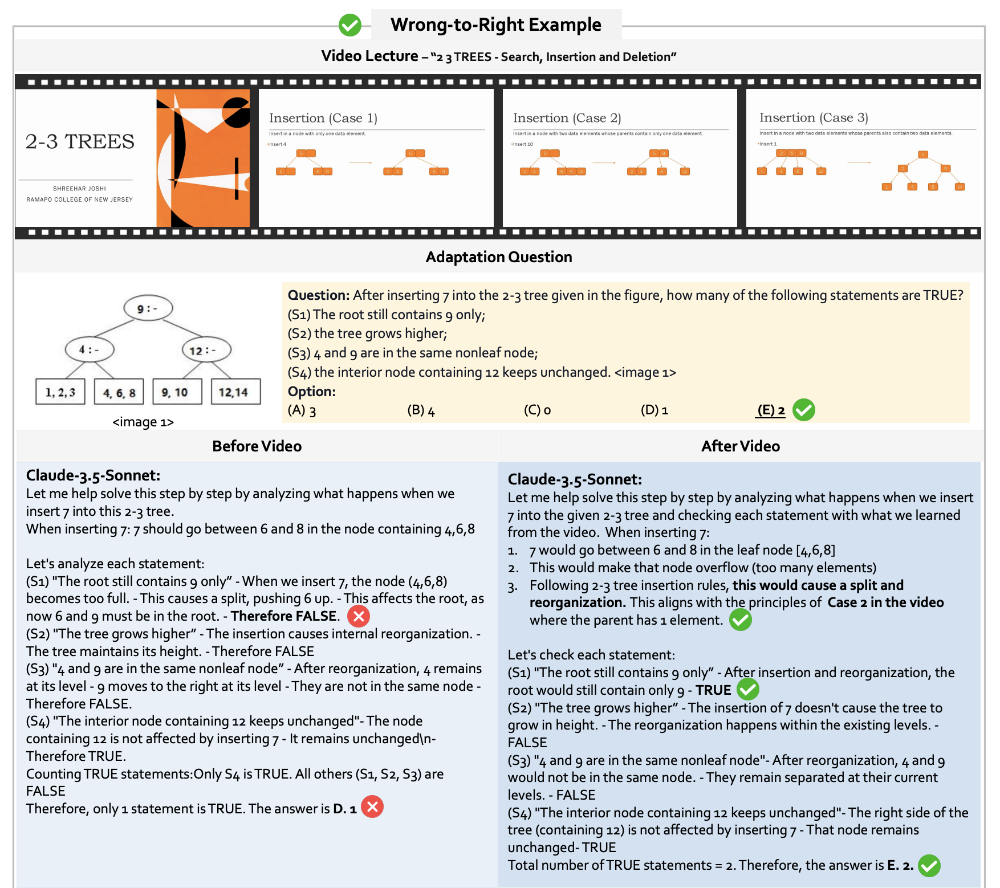

#  Video-MMMU: Evaluating Knowledge Acquisition from Multi-Discipline Professional Videos

<p align="center">
  <a href="https://videommmu.github.io/"></a>
  <a href="https://arxiv.org/abs/2501.13826"></a>
  <a href="https://huggingface.co/datasets/lmms-lab/VideoMMMU"></a>
  <a href="https://lmms-lab.framer.ai"></a>
  <a href="https://discord.gg/zdkwKUqrPy"></a>
</p>

🖋 [Kairui Hu](https://kairuihu.github.io/), [Penghao Wu](https://penghao-wu.github.io/), [Fanyi Pu](https://github.com/pufanyi), [Wang Xiao](https://www.ntu.edu.sg/s-lab), [Xiang Yue](https://xiangyue9607.github.io/), [Bo Li](https://brianboli.com/), [Yuanhan Zhang](https://zhangyuanhan-ai.github.io/), and [Ziwei Liu](https://liuziwei7.github.io/)

---

## 🔥 News
- [2025-2] 🎉🎉 We update the leaderboard for [Qwen-2.5-VL-72B](https://huggingface.co/Qwen/Qwen2.5-VL-72B-Instruct) and [mPLUG-Owl3-7B](https://github.com/X-PLUG/mPLUG-Owl/tree/main/mPLUG-Owl3).
- [2025-1] 🎉🎉 We introduce [VideoMMMU](https://videommmu.github.io/), a massive, multi-modal, multi-disciplinary video benchmark that evaluates the **knowledge acquisition capability** from educational videos.


## 🧠 Overview  
  

Video-MMMU is the first benchmark to assess knowledge acquisition from educational videos, evaluating how well LMMs learn new knowledge from videos and apply what they learn in practice.

### 1) Knowledge-Intensive Video Collection
Video-MMMU features 300 **lecture-style videos** covering 6 professional disciplines—Art, Business, Science, Medicine, Humanities, and Engineering, spanning 30 subjects.

### 2) Knowledge Acquisition-Based Question Design  
Each video is accompanied by 3 QA pairs, designed to evaluate video-based learning at different cognitive levels:  
- **Perception** – Identifying key information.  
- **Comprehension** – Understanding underlying concepts.  
- **Adaptation** – Applying knowledge to new scenarios.  

This results in 900 question-answer pairs (300 videos × 3 QA pairs per video), systematically measuring a model's ability to acquire and apply knowledge from videos.  


## 🔍 A New Perspective on VideoQA 


*Figure 2: The model improves its ability to solve previously incorrect problems by watching the video. The ability to solve problems is not the only evaluation criterion; acquiring knowledge and correcting previously incorrect answers is also an important capability.*


### Videos as a Knowledge Source 
Traditional VideoQA benchmarks focus primarily on scene-based understanding, evaluating how well models interpret visual content. Video-MMMU takes a different approach—it is the first to treat videos as a **source of knowledge**, assessing how effectively large multimodal models (LMMs) acquire and apply information from educational videos.  

### Measuring Knowledge Gain: The Δknowledge Metric
A key novelty of Video-MMMU is that it evaluates not just a model’s absolute accuracy but also its **delta accuracy**—the improvement in performance after learning from a video. A model may initially fail to solve an exam question, but we give the model a video where a human could learn to solve the question by watching the video. Video-MMMU tests how well LMMs improve their performance after watching the videos. Video-MMMU introduces Δknowledge to quantify knowledge gain by evaluating a model’s improvement on practice exam questions (Adaptation track) after watching a video. 

### Why Is This Important?  
Intelligence is not just about solving tasks, but also about **how efficiently a model can acquire and apply new knowledge**. Video-MMMU is the first benchmarks designed to assess this capability, marking a significant step toward more advanced multimodal evaluation. 


## ❓QA Design


**Perception**  
- ASR (Automatic Speech Recognition): The **Art** category (top left).  
- OCR (Optical Character Recognition): The **Business** category (bottom left).  

**Comprehension**  
- Concept Comprehension: The **Humanities** category (top center).  
- Problem-Solving Strategy Comprehension: The **Science** category (bottom center).  

**Adaptation**  
- Case Study Analysis: The **Medicine** category (top right).  
- Problem-Solving Strategy Adaptation: The **Engineering** category (bottom right).  


## 🛠️ Evaluation Pipeline
The evaluation of VideoMMMU is integrated into [LMMs-Eval](https://github.com/EvolvingLMMs-Lab/lmms-eval/tree/main). Below is a detailed instruction of the evaluation.

### Installation

For formal usage, you can install the package from PyPI by running the following command:
```bash
pip install lmms-eval
```

For development, you can install the package by cloning the repository and running the following command:
```bash
git clone https://github.com/EvolvingLMMs-Lab/lmms-eval
cd lmms-eval
pip install -e .
```

If you want to test LLaVA, you will have to clone their repo from [LLaVA](https://github.com/haotian-liu/LLaVA) and
```bash
git clone https://github.com/LLaVA-VL/LLaVA-NeXT
cd LLaVA-NeXT
pip install -e .
```

### Evaluation

We use [LLaVA-OneVision-7B](https://huggingface.co/llava-hf/llava-onevision-qwen2-7b-ov-hf) as an example in the following commands. You can change `--model`, and `--model_args` based on your requirement.

**Evaluation of LLaVA-OneVision on VideoMMMU (all 3 tracks)**

```bash
accelerate launch --num_processes=1 --main_process_port 12345 -m lmms_eval \
--model llava_onevision \
--model_args pretrained=lmms-lab/llava-onevision-qwen2-7b-ov,conv_template=qwen_1_5,model_name=llava_qwen,max_frames_num=32,torch_dype=bfloat16 \
    --tasks video_mmmu \
    --batch_size 1 \
    --log_samples \
    --log_samples_suffix debug \
    --output_path ./logs/
```

**Evaluate a single track of VideoMMMU**

Perception track: 
```bash
accelerate launch --num_processes=1 --main_process_port 12345 -m lmms_eval \
--model llava_onevision \
--model_args pretrained=lmms-lab/llava-onevision-qwen2-7b-ov,conv_template=qwen_1_5,model_name=llava_qwen,max_frames_num=32,torch_dype=bfloat16 \
    --tasks video_mmmu_perception \
    --batch_size 1 \
    --log_samples \
    --log_samples_suffix debug \
    --output_path ./logs/
```

Comprehension track: 
```bash
accelerate launch --num_processes=1 --main_process_port 12345 -m lmms_eval \
--model llava_onevision \
--model_args pretrained=lmms-lab/llava-onevision-qwen2-7b-ov,conv_template=qwen_1_5,model_name=llava_qwen,max_frames_num=32,torch_dype=bfloat16 \
    --tasks video_mmmu_comprehension \
    --batch_size 1 \
    --log_samples \
    --log_samples_suffix debug \
    --output_path ./logs/
```

Adaptation track: 
```bash
accelerate launch --num_processes=1 --main_process_port 12345 -m lmms_eval \
--model llava_onevision \
--model_args pretrained=lmms-lab/llava-onevision-qwen2-7b-ov,conv_template=qwen_1_5,model_name=llava_qwen,max_frames_num=32,torch_dype=bfloat16 \
    --tasks video_mmmu_adaptation \
    --batch_size 1 \
    --log_samples \
    --log_samples_suffix debug \
    --output_path ./logs/
```

**Evaluate the question_only track of VideoMMMU -- Knowledge Acquisition Experiment (∆knowledge)**

The "question_only" track consists of 2-second videos that contain the image associated with the Adaptation Track question. This is the baseline for ∆knowledge.

To evaluate this setting, you can use the following command:

```bash
accelerate launch --num_processes=1 --main_process_port 12345 -m lmms_eval \
--model llava_onevision \
--model_args pretrained=lmms-lab/llava-onevision-qwen2-7b-ov,conv_template=qwen_1_5,model_name=llava_qwen,max_frames_num=1,torch_dype=bfloat16 \
    --tasks video_mmmu_adaptation_question_only \
    --batch_size 1 \
    --log_samples \
    --log_samples_suffix debug \
    --output_path ./logs/
```

***Adaptation Track setting***

To ensure compatibility with [LMMs-Eval](https://github.com/EvolvingLMMs-Lab/lmms-eval), the image associated with the Adaptation Track question has been appended in the last frame of the video. A prompt has also been added to inform the model that the question image is located in this final frame.

As a result, you can execute the commands from the previous section without manually interleaving the image and video.

If you prefer an interleaved format, you can manually insert the image (either the last frame of the video or the ```image 1``` entry from the HF dataset) into the designated placeholder ```<image 1>```.


## 🎓 Video-MMMU Leaderboard
---

We evaluate various open-source and proprietary LMMs. The table below provides a detailed comparison. To submit your model results, please send an email to videommmu2025@gmail.com.


| Model | Overall | Perception | Comprehension | Adaptation | Δknowledge |
|---|---|---|---|---|---|
| **Human Expert** | 74.44 | 84.33 | 78.67 | 60.33 | +33.1 |
| [Claude-3.5-Sonnet](https://www.anthropic.com/news/claude-3-5-sonnet) | 65.78 | 72.00 | 69.67 | 55.67 | +11.4 |
| [GPT-4o](https://openai.com/index/hello-gpt-4o/) | 61.22 | 66.00 | 62.00 | 55.67 | +15.6 |
| [Qwen-2.5-VL-72B](https://huggingface.co/Qwen/Qwen2.5-VL-72B-Instruct) | 60.22 | 69.33 | 61.00 | 50.33 | +9.7 |
| [Gemini 1.5 Pro](https://deepmind.google/technologies/gemini/pro/) | 53.89 | 59.00 | 53.33 | 49.33 | +8.7 |
| [Aria](https://rhymes.ai/blog-details/aria-first-open-multimodal-native-moe-model) | 50.78 | 65.67 | 46.67 | 40.00 | +3.2 |
| [Gemini 1.5 Flash](https://storage.googleapis.com/deepmind-media/gemini/gemini_v1_5_report.pdf) | 49.78 | 57.33 | 49.00 | 43.00 | -3.3 |
| [LLaVA-Video-72B](https://huggingface.co/lmms-lab/LLaVA-Video-72B-Qwen2) | 49.67 | 59.67 | 46.00 | 43.33 | +7.1 |
| [LLaVA-OneVision-72B](https://huggingface.co/llava-hf/llava-onevision-qwen2-72b-ov-hf) | 48.33 | 59.67 | 42.33 | 43.00 | +6.6 |
| [Qwen-2.5-VL-7B](https://huggingface.co/Qwen/Qwen2.5-VL-7B-Instruct) | 47.44 | 58.33 | 44.33 | 39.67 | +2.2 |
| [mPLUG-Owl3-7B](https://github.com/X-PLUG/mPLUG-Owl/tree/main/mPLUG-Owl3) | 42.00 | 49.33 | 38.67 | 38.00 | +7.5 |
| [MAmmoTH-VL-8B](https://mammoth-vl.github.io/) | 41.78 | 51.67 | 40.00 | 33.67 | +1.5 |
| [InternVL2-8B](https://huggingface.co/OpenGVLab/InternVL2-8B) | 37.44 | 47.33 | 33.33 | 31.67 | -8.5 |
| [LLaVA-Video-7B](https://huggingface.co/lmms-lab/LLaVA-Video-7B-Qwen2) | 36.11 | 41.67 | 33.33 | 33.33 | -5.3 |
| [VILA1.5-40B](https://huggingface.co/Efficient-Large-Model/VILA1.5-40b) | 34.00 | 38.67 | 30.67 | 32.67 | +9.4 |
| [LLaVA-OneVision-7B](https://huggingface.co/llava-hf/llava-onevision-qwen2-7b-ov-hf) | 33.89 | 40.00 | 31.00 | 30.67 | -5.6 |
| [Llama-3.2-11B](https://ai.meta.com/blog/llama-3-2-connect-2024-vision-edge-mobile-devices/) | 30.00 | 35.67 | 32.33 | 22.00 | - |
| [LongVA-7B](https://huggingface.co/lmms-lab/LongVA-7B) | 23.98 | 24.00 | 24.33 | 23.67 | -7.0 |
| [VILA1.5-8B](https://huggingface.co/Efficient-Large-Model/Llama-3-VILA1.5-8B-Fix) | 20.89 | 20.33 | 17.33 | 25.00 | +5.9 |


## Citation

```shell
@article{hu2025videommmu,
    title={Video-MMMU: Evaluating Knowledge Acquisition from Multi-Discipline Professional Videos},
    author={Kairui Hu and Penghao Wu and Fanyi Pu and Wang Xiao and Yuanhan Zhang and Xiang Yue and Bo Li and Ziwei Liu},
    booktitle={arXiv preprint arXiv:2501.13826},
    year={2025},
    url={https://arxiv.org/abs/2501.13826}
}

